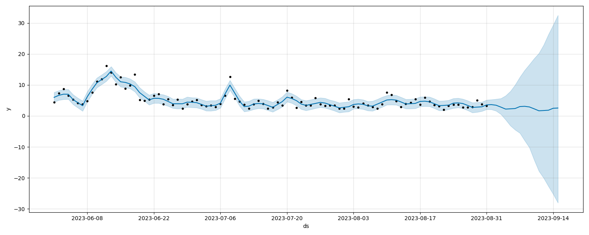

# IoT data processing simulation

This project simulates a machine learning based IoT data processing pipeline in an edge-cloud setting. A server on the edge layer collects weather data from IoT sensors located at the Newcastle's Urban Observatory and uses the MQTT protocol to send the data to another server on the edge layer (the same server in this simulation). The server then performes some data processing (removing outliers, calculating 24-hour averages) and uses the RabbitMQ protocol to send the processed data to a server on the cloud layer. That server uses the data to train a machine learning model which predicts the weather trends for the next 15 days.


*Image1: Data flow pipeline*

---

## How to run

Make sure to change the IP addresses in `mqtt_subscriber`, `mqtt_publisher`, `rabbitmq_producer`, and `rabbitmq_consumer` to correspond with the edge/cloud server IP addresses on your network.

### Edge layer setup

On a server in the **edge layer**, pull the EMQX Docker image (an MQTT platform):
```bash
docker pull emqx
```

And start the container:
```bash
docker run -d --name emqx -p 18083:18083 -p 1883:1883 emqx:latest
```

The `docker ps` command shows a running EMQX service:


*Image 2: Terminal output showing a running EMQX container*

Now build a Docker image using the provided Dockerfile:
```bash
sudo docker build -t data_injector:latest . 
```

Start the container which runs the MQTT subscriber:
```bash
sudo docker-compose up
```

### Cloud layer setup

Build a Docker image from the provided Dockerfile (on a server in the **cloud layer**):
```bash
sudo docker build -t data_processor:latest .
```

Start the RabbitMQ service container and data_processor container:
```bash
sudo docker-compose up
```

Two containers should be running on cloud:


*Image 3: Terminal output showing running data_processor and rabbitmq containers*

Now that all the subscribers/consumers are ready and listening for messages, we can run the MQTT publisher script which initiates the process of collecting data from the IoT sensors all the way to the model training.

On the **edge layer** server, run the publisher script:
```bash
python3 mqtt_publisher.py
```

You can see the terminal outputs on the MQTT/RabbitMQ services as the data get passed along. A new folder 'output' is created in the working directory on cloud.

As a result, two new images are created on the Cloud layer in the output directory - `Averages_over_time` and `prediction`. The former shows a graph of daily averages of weather PM2.5 data collected from the sensors and the latter shows the prediction output from the model.


*Image 4: Averaged weather data collected from the sensors*



*Image 5: Predictions made by the trained model*
